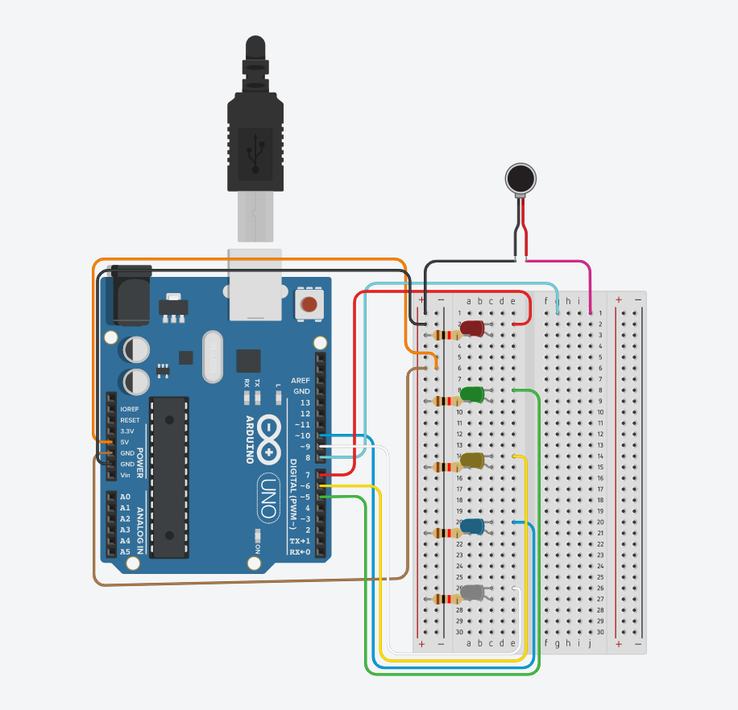

# **proyecto audiovisual / villancico con luces de navidad**

## acerca de

El objetivo de este es crear un juego de luces a partir de la melodía navideña “Jingle Bells” coordinando así las luces con las respectivas notas de esta melodía, respetando los tiempos de cada nota y asignándoles un LED de color, logrando imitar lo que serian las luces de un árbol de navidad por medio del Arduino.

los integrantes de este proyecto son 
* Cristina Chamorro
* Fabián Campos
* Antonia Ramírez

*este proyecto fue hecho en el día martes 10 de mayo 2022, como parte del curso  aud5i022-2022-1.*

## lista de materiales

los materiales son:

* Arduino Uno
* protoboard
* cables
* parlante
* luces
* resistores

## armado de circuito

estos son los pasos para armar el circuito:

1. Conectamos el dispositivo Arduino 1 al puerto USB  del computador 

2. Dividimos el trabajo en dos partes, la sección luces y la sección melodia 

3. Investigamos acerca de la melodía y cómo codificarla, concluimos en que la melodía consta de 5 notas a las que cada una le corresponderá un color de LED
  

  
  *   la **luz roja** es la nota **DO6**
  *   la **luz amarilla** es la nota **SOL5**
  *   la **luz verde** es la nota **RE6**
  *   la **luz azul** es la nota **SI5**
  *   La **luz blanca** es la nota **LA5**

4. Buscamos referentes de códigos que podrían sernos útiles para ambas partes 

*esto pertenece a [JuegosRobótica.es](https://juegosrobotica.es/musica-con-arduino/#)*

5. Seleccionamos el código de semáforo de la clase 04 y lo modificamos,  aumentando  la cantidad de luces led de 3 a 5, agregando el color azul y blanco 

6. Nuestro primer surgió cuando el circuito de luces ya programado se saltaba los led de color verde y azul, revisamos el codigo sin ningun exito, tras solicirtar ayuda llegamos a la fuente del problema, las luces led estaban conectadas a pines equivocados, problema que nos mantuvo parados por un largo tiempo

7. Con ese problema resuelto tenemos las luces listas para ser mezcladas con la melodía 

* En primer lugar se buscó la partitura de la melodía *Jingle Bells*

* Se identifican 5 tipos distintos de notas musicales que componen una melodía de 26 notas

* Posteriormente se buscó el código de 26 notas musicales en el lenguaje de Arduino

* Luego se tradujo cada nota de la melodía en su notación en Arduino como variable de int melodía[]

* Se definieron los tiempo de duración de cada nota en base a la variable int duraciones[] considerando el valor de una corchea como 8 unidades

* Se define un multiplicador del doble del tiempo de duración de las notas como variable int multiplicadorDuracion[]

* Se define la pausa entre notas por variable float multiplicadorPausa del mismo valor que su multiplicador de duración

* Se define en el código la salida del sonido por el parlante con la variable int pinParlante sobre la entrada 8 del equipo de Arduino

* Se establece el void setup() de la reproducción de la música bajo la función for(int nota = X; nota < Y; nota++), indicando el inicio y final de la reproducción desde la nota 0 a la nota 26 por orden consecutivo

* Se establece por función tone() la frecuencia y duración de las notas, así como el pin de salida, para su reproducción según las variables establecidas

* Se define a duración de las notas de la melodía en milisegundos por la función int duracionNota = 1000/(duraciones[] * multiplicadorDuración)

* Se define las pausas entre notas de la melodía en milisegundos como delay(pausa) determinado por la función int pausa = duracionNota * multiplicadorPausa

* Se condiciona el encendido específico de cada luz al momento que suena un tipo de nota específico de la melodía, asignando un color de las 5 luces a uno de los 5 tipos de notas de la melodía, según la funcion if() {else if(){...}}

* Se establece el inicio de la comunicación serial de las luces por función Serial.beging(9600)

* Se configura las salidas para el puerto del Arduino que se comunicaran con cada luz LED por la función pinMode(pinCOLOR, OUTPUT)

* Se finaliza el void setup() y se ignora el void loop()

* Se especifíca la función de encendido de luces según el color designado y el tiempo que dura encendida, por función void prenderLuz(int color, int tiempoEncendido), definiendo la variable delay(tiempoEncendido), así como el color y su estado de encendido, por digitalWrite(color, HIGH)

* Se especifíca la funcion de apagado de cada luz por pin de salida según función digitalWrite(pinCOLOR, LOW)

## código para microcontrolador Arduino

el código está hecho para Arduino Uno, y está incluido en este repositorio [aquí](https://github.com/FabianCQ/clase-09-proyecto-mitad-semestre/blob/main/codigo_arduino/codigo_arduino.ino)

este código está basado en el trabajo de nuestro profesor [aarón montoya](https://github.com/montoyamoraga) y en el ejemplo de semáforo de la [clase 04](https://github.com/montoyamoraga/aud5i022-2022-1/tree/main/clases/clase-04) y la [clase 07](https://github.com/montoyamoraga/aud5i022-2022-1/tree/main/clases/clase-07) sobre entrada y salida MIDI

## conclusiones

en este proyecto tuvimos los siguientes aprendizajes:

* circuito para luces
* circuito con salida de sonido
* programación de melodía y luces coordinadas

lo más difícil de este proyecto fue sin duda el traducir y calzar los tiempos de la la melodía al arduino ya que era un ejercicio de mayor complejidad comparado a lo que habíamos aprendido en clases anteriores, por otro lado el segundo desafío se nos presentó cuando debiamos  mezclar los dos aprendizajes adquiridos en las clases (programar  luces y la salida de audio) y convertirlo en uno, si bien ya habíamos resuelto las cosas por separado ahora fusionar  los códigos de la manera  correcta era la clave de nuestro éxito.

los errores principales que cometimos fueron de redacción de código, si bien sabíamos cómo debía estar compuesto para que este funcionara, de igual manera se nos escapaban letras o puntos entre ellos error que retrasó un poco nuestro avance. Otro error que cometimos fue el no relacionar  el código con los pines del arduino y sin saber  que había un problema técnico de conexión buscamos errores dentro del código pero no tuvimos éxito.

Finalmente este proyecto hizo darnos cuenta de los circuitos que están detrás de los objetos que uno utiliza comúnmente como pueden ser las luces de navidad o un timbre de casa, imaginamos además que en un futuro se podría utilizar para realizar juegos de luces para eventos masivos, fiestas o exposiciones y generar toda una experiencia inmersiva por medio de una  pantalla completa de luces y varios  arduinos que guíen la proyección y la música.

